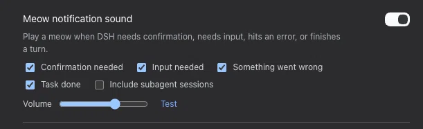

# dsh-meow

**Hear when DSH needs you — or is done.** A DeepSeek Harness web plugin that
plays a short synthesized meow in the browser at four moments, with an
enable/disable toggle in **Settings → General**.

No audio file ships with the plugin: each meow is generated live with the Web
Audio API, so there is nothing to download and no binary asset to trust.

## Compatibility

Built and verified against **DeepSeek Harness 0.2.1-alpha.1** with Cordis
4.0.5-alpha.1 on macOS and Node 24. It uses only published extension points —
the approval/request and user-questions/request waterfalls, session/event, the
webServer route registry, the slot registry, and the dsh.client bundle
format.

The `@deepseek-ai/dsh-*` `peerDependencies` and `engines.dsh` ranges name the
DSH line this build targets. DSH 0.2 added a boot-time compatibility preflight
that disables any bundle whose DSH peer ranges do not satisfy the running
version, so keep those ranges in step with the DSH version you run.

## The four moments

| Moment | Host observation point | Meow character |
|---|---|---|
| Confirmation needed | a prepended listener on the approval/request waterfall | questioning rise, bright |
| Input needed | a prepended listener on the user-questions/request waterfall | softer triangle |
| Something wrong | turn/end with reason error | low and long |
| Task done | turn/end with reason completed | content, slightly higher |

The approval listener is prepended so it fires only when an answerer is
actually consulted: the approval service resolves the never policy before
dispatch, so a session that auto-rejects approvals stays silent. The question
listener is prepended and delegates with next(), so it observes the request
without claiming it from the browser answerer.

## Settings

Open **Settings → General** and find **Meow notification sound**. The master
switch is the enable/disable control. While it is on, the row also offers:

- one checkbox per moment (confirmation, input, error, done);
- **Include subagent sessions** — off by default, so a delegated child's turn
  end does not meow;
- a volume slider;
- **Test** to hear the meow immediately.

*The Settings → General row: master switch, one checkbox per moment, the
subagent opt-in, volume, and Test.*

Settings are stored in a plugin-owned file at $DSH_HOME/dsh-meow.json (by
default ~/.dsh/dsh-meow.json), so toggling needs no profile reload.

## Install

Install straight from GitHub (the built lib/ is committed, so no build step
runs on install):

~~~
pnpm dsh plugin --profile web add git+ssh://git@github.com/nonmean/dsh-meow.git
~~~

Or, from a local checkout, point the profile at the directory:

~~~
pnpm dsh plugin --profile web add link:/path/to/dsh_meow
~~~

This appends dsh-meow to the web profile's bundle list and mounts its
cordis.patch.yml host row. The browser half ships through the package.json
dsh.client declaration and needs no separate roster row.

Then **restart dsh web** (or reload the page if the profile HMR picked the row
up) and hard-refresh the browser so the new client bundle is fetched. The
Settings row appears under General.

To remove it:

~~~
pnpm dsh plugin --profile web remove dsh-meow
~~~

## How it works

- **Host half** (lib/index.js) observes the four moments, keeps a bounded,
  per-kind-deduplicated queue, and serves three same-origin JSON routes:
  GET /meow/state, POST /meow/state, and GET /meow/events?since=N.
- **Browser half** (lib/client.js) polls /meow/events every 700 ms and plays
  one synthesized meow per queued event, and registers the Settings row. The
  first poll adopts the host cursor without playing, so reloading a page never
  replays an old backlog.
- Routes refuse cross-site callers (Sec-Fetch-Site: cross-site).

Browsers block audio until a user gesture. The player resumes its AudioContext
on the first pointer or key event, and only schedules while the context is
running, so a meow plays from the first event after you interact with the page.

## Development

~~~
pnpm install     # or symlink node_modules as described below
pnpm build       # tsdown -> lib/index.js + lib/client.js (committed)
pnpm typecheck   # tsc --noEmit
pnpm smoke       # host- and browser-half smoke tests, no DSH runtime needed
~~~

The browser bundle is emitted in the DSH client module system's lazy-CJS
factory format (window.__ModuleLoader__.load), with only the frozen
platform-module table kept external. lib/ is committed on purpose so the
plugin installs from a checkout or a git URL without a build step.

## Troubleshooting

| Symptom | Fix |
|---|---|
| No sound at all | Click or type in the page once (browser autoplay policy), then Test. |
| Settings row missing | Restart dsh web and hard-refresh; confirm the bundle is in the web profile's dsh.profile.bundles. |
| Meows too often | Turn off individual moments, or keep Include subagent sessions off. |
| Meows on every tool error | The plugin only meows on a turn that ends in error, not on recoverable tool errors; if a turn ends in error repeatedly, that is the signal. |

## Version history

- **0.2.0** — retargeted to DeepSeek Harness 0.2.1-alpha.1 and Cordis
  4.0.5-alpha.1. The `@deepseek-ai/dsh-*` `peerDependencies` and
  `engines.dsh` now satisfy the DSH 0.2 compatibility preflight (the earlier
  ranges made the launcher skip the bundle), and the build uses tsdown's
  `deps` API. Rebuilt artifacts are byte-identical.
- **0.1.0** — initial release for DeepSeek Harness 0.1.7-alpha.2.
